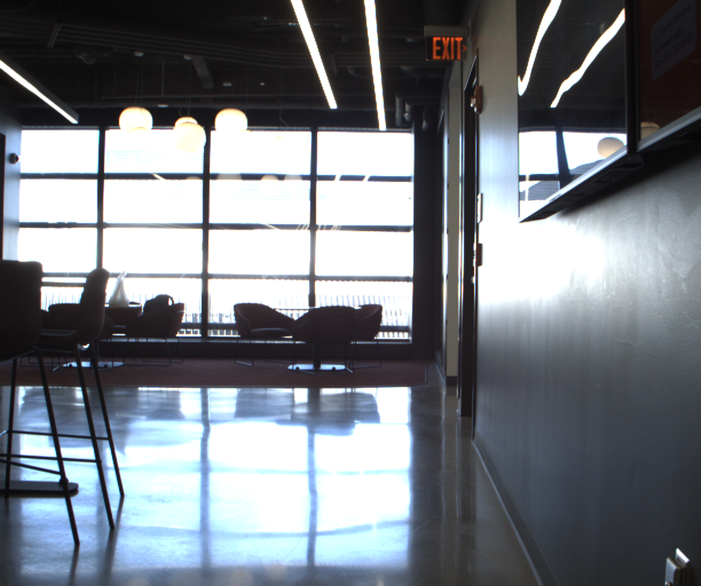

# NeuROAM

This document outlines the steps and process to access dataset, and also throws light on the methodology used while collecting data

## 1. Dataset
* **Topics:** 
```
{
	"aid": [
		"/aidalm",
		"/aideph"
	],
	"camera_sync": [
		"/cam_sync/cam0/camera_info",
		"/cam_sync/cam0/image_raw/compressed",
		"/cam_sync/cam0/meta",
		"/cam_sync/cam1/camera_info",
		"/cam_sync/cam1/image_raw/compressed",
		"/cam_sync/cam1/meta"
	],
	"diagnostics": [
		"/computer/diagnostics",
		"/diagnostics",
		"/node/diagnostics"
	],
	"doodle_monitor": [
		"/doodle_monitor/activity",
		"/doodle_monitor/iperf_result",
		"/doodle_monitor/lna_status",
		"/doodle_monitor/mesh_status",
		"/doodle_monitor/noise",
		"/doodle_monitor/peer_list",
		"/doodle_monitor/raw",
		"/doodle_monitor/sta_status",
		"/doodle_monitor/sys/cpu_load",
		"/doodle_monitor/sys/freemem",
		"/doodle_monitor/sys/localtime"
	],
	"navigation": [
		"/interrupt_time",
		"/monhw",
		"/navclock",
		"/navcov",
		"/navstate",
		"/navstatus",
		"/nmea",
		"/rxmraw",
		"/rxmrtcm",
		"/rxmsfrb",
		"/timtm2"
	],
	"ouster_lidar": [
		"/ouster/imu",
		"/ouster/metadata",
		"/ouster/nearir_image",
		"/ouster/points",
		"/ouster/reflec_image",
		"/ouster/signal_image"
	],
	"ros_system": [
		"/parameter_events",
		"/rosout",
		"/tf_static"
	],
	"ublox_gps": [
		"/ublox_gps_node/fix",
		"/ublox_gps_node/fix_velocity",
		"/ublox_gps_node/navpvt"
	],
	"vectornav": [
		"/vectornav/gnss",
		"/vectornav/imu",
		"/vectornav/imu_uncompensated",
		"/vectornav/magnetic",
		"/vectornav/pose",
		"/vectornav/pressure",
		"/vectornav/temperature",
		"/vectornav/velocity_body",
		"/vectornav/time_gps",
		"/vectornav/time_pps",
		"/vectornav/time_startup",
		"/vectornav/time_syncin",
		"/vectornav/raw/attitude",
		"/vectornav/raw/common",
		"/vectornav/raw/gps",
		"/vectornav/raw/gps2",
		"/vectornav/raw/imu",
		"/vectornav/raw/ins",
		"/vectornav/raw/time"
	]
}
```
* **Bags:** 
    * Calibration (28 Aug 2025) (Before and after calibration)
        1. Payload 0 - [hreflink1](www.google.com), [hreflink2](www.google.com)
        2. Payload 1 - [hreflink1](www.google.com), [hreflink2](www.google.com)
        3. Payload 2 - [hreflink1](www.google.com), [hreflink2](www.google.com)
        4. Payload 3 - [hreflink1](www.google.com), [hreflink2](www.google.com)
        5. Payload 4 - [hreflink1](www.google.com), [hreflink2](www.google.com)

    * Data Collection (28 Aug 2025)
        1. Payload 0 - [hreflink1](www.google.com)
        2. Payload 1 - [hreflink1](www.google.com)
        3. Payload 2 - [hreflink1](www.google.com)
        4. Payload 3 - [hreflink1](www.google.com)
        5. Payload 4 - [hreflink1](www.google.com)

    * Calibration (100 Aug 2025)  (Before and after calibration)
        1. Payload 0 - [hreflink1](www.google.com), [hreflink2](www.google.com)
        2. Payload 1 - [hreflink1](www.google.com), [hreflink2](www.google.com)
        3. Payload 2 - [hreflink1](www.google.com), [hreflink2](www.google.com)
        4. Payload 3 - [hreflink1](www.google.com), [hreflink2](www.google.com)
        5. Payload 4 - [hreflink1](www.google.com), [hreflink2](www.google.com)

    * Data Collection (100 Aug 2025)
        1. Payload 0 - [hreflink1](www.google.com)
        2. Payload 1 - [hreflink1](www.google.com)
        3. Payload 2 - [hreflink1](www.google.com)
        4. Payload 3 - [hreflink1](www.google.com)
        5. Payload 4 - [hreflink1](www.google.com)

	* Calibration results (28 Aug 2025)
		| Calibration Pair | Payload 0 | Payload 1 | Payload 2 | Payload 3 | Payload 4 |
		|------------------|-----------|-----------|-----------|-----------|-----------|
		| Cam0 – Cam1      | [Link](www.github.com) | [Link](www.github.com) | [Link](www.github.com) | [Link](www.github.com) | [Link](www.github.com) |
		| Cam0 – IMU       | [Link](www.github.com) | [Link](www.github.com) | [Link](www.github.com) | [Link](www.github.com) | [Link](www.github.com) |
		| Cam0 – Lidar     | [Link](www.github.com) | [Link](www.github.com) | [Link](www.github.com) | [Link](www.github.com) | [Link](www.github.com) |

	* Calibration results (100 Aug 2025)
		| Calibration Pair | Payload 0 | Payload 1 | Payload 2 | Payload 3 | Payload 4 |
		|------------------|-----------|-----------|-----------|-----------|-----------|
		| Cam0 – Cam1      | [Link](www.github.com) | [Link](www.github.com) | [Link](www.github.com) | [Link](www.github.com) | [Link](www.github.com) |
		| Cam0 – IMU       | [Link](www.github.com) | [Link](www.github.com) | [Link](www.github.com) | [Link](www.github.com) | [Link](www.github.com) |
		| Cam0 – Lidar     | [Link](www.github.com) | [Link](www.github.com) | [Link](www.github.com) | [Link](www.github.com) | [Link](www.github.com) |

    * Supporting Scripts
        * Read all messages [Link](www.github.com)
        * Extract and debayer images [Link](www.github.com)
        * Read point-clouds [Link](www.github.com)
        * Read all messages etc....... [Link](www.github.com)
		* Debayering images node [Link](www.github.com)

	* IMU calibration files
		| IMU number | Results |
		|------------------|-----------|
		| Payload 0  | [Link](www.github.com) |
		| Payload 1  | [Link](www.github.com) |
		| Payload 2  | [Link](www.github.com) |
		| Payload 3  | [Link](www.github.com) |
		| Payload 4  | [Link](www.github.com) |

* **Extracted Data**

    Data from 28th August 2025

    | Data Type   | Payload 0 | Payload 1 | Payload 2 | Payload 3 | Payload 4 |
    |-------------|-----------|-----------|-----------|-----------|-----------|
    | PNG Images  | [Link](www.google.com)| [Link](www.google.com)| [Link](www.google.com)| [Link](www.google.com)| [Link](www.google.com)|
    | IMU (CSV)   | [Link](www.google.com)| [Link](www.google.com)| [Link](www.google.com)| [Link](www.google.com)| [Link](www.google.com)|
    | GPS (CSV)   | [Link](www.google.com)| [Link](www.google.com)| [Link](www.google.com)| [Link](www.google.com)| [Link](www.google.com)|
    | Radio Data (CSV) | [Link](www.google.com)   | [Link](www.google.com)| [Link](www.google.com)| [Link](www.google.com)| [Link](www.google.com)|
    | Point Cloud data (PLY) | [Link](www.google.com)   | [Link](www.google.com)| [Link](www.google.com)| [Link](www.google.com)| [Link](www.google.com)|

    Data from 100th August 2025

    | Data Type   | Payload 0 | Payload 1 | Payload 2 | Payload 3 | Payload 4 |
    |-------------|-----------|-----------|-----------|-----------|-----------|
    | PNG Images  | [Link](www.google.com)| [Link](www.google.com)| [Link](www.google.com)| [Link](www.google.com)| [Link](www.google.com)|
    | IMU (CSV)   | [Link](www.google.com)| [Link](www.google.com)| [Link](www.google.com)| [Link](www.google.com)| [Link](www.google.com)|
    | GPS (CSV)   | [Link](www.google.com)| [Link](www.google.com)| [Link](www.google.com)| [Link](www.google.com)| [Link](www.google.com)|
    | Radio Data (CSV) | [Link](www.google.com)   | [Link](www.google.com)| [Link](www.google.com)| [Link](www.google.com)| [Link](www.google.com)|
    | Point Cloud data (PLY) | [Link](www.google.com)   | [Link](www.google.com)| [Link](www.google.com)| [Link](www.google.com)| [Link](www.google.com)|

* **April tags:** 
	* Size of April tag
	* Ids of all tags
	* Location of tags

* **Places Covered** - 
	* EXP and ISEC map images
	

	* Outdoor route map overlaid with google maps
	* 

## 2. Payload and Software information
* **Hardware:**
    * FLIR cameras (stereo pair)
    * Ouster Lidar 32 and 128 channel
    * Vectornav IMU
    * Ublox GPS
    * Doodlelabs Radio
    * Jetson Nano

* **Robots Used** : 
    1. BD Spot
    2. Unitree Go2W
    3. Agilex Hunter
    4. Agilex Scout
    5. Unitree Go
  
* **Calibration steps**
	* Recording the bag
	* Target information
	* Kalibr
	* Imu information
	* Lidar calibration tool

* **Software config required to play bag**
	* Build packages for vectornav, ublox , ouster and doodlelabs radio
	* Install zenoh middleware for playing bags smoothly
	* Debayering process for images
	* 
## 3. SLAM results / analysis