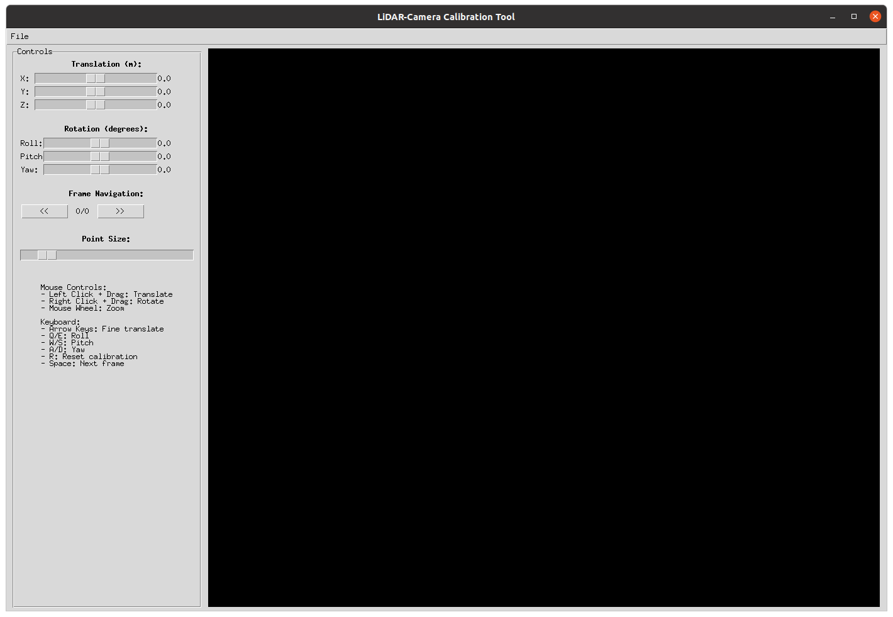
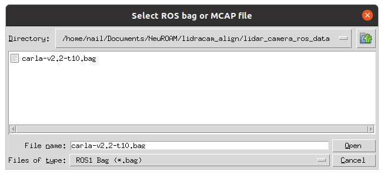
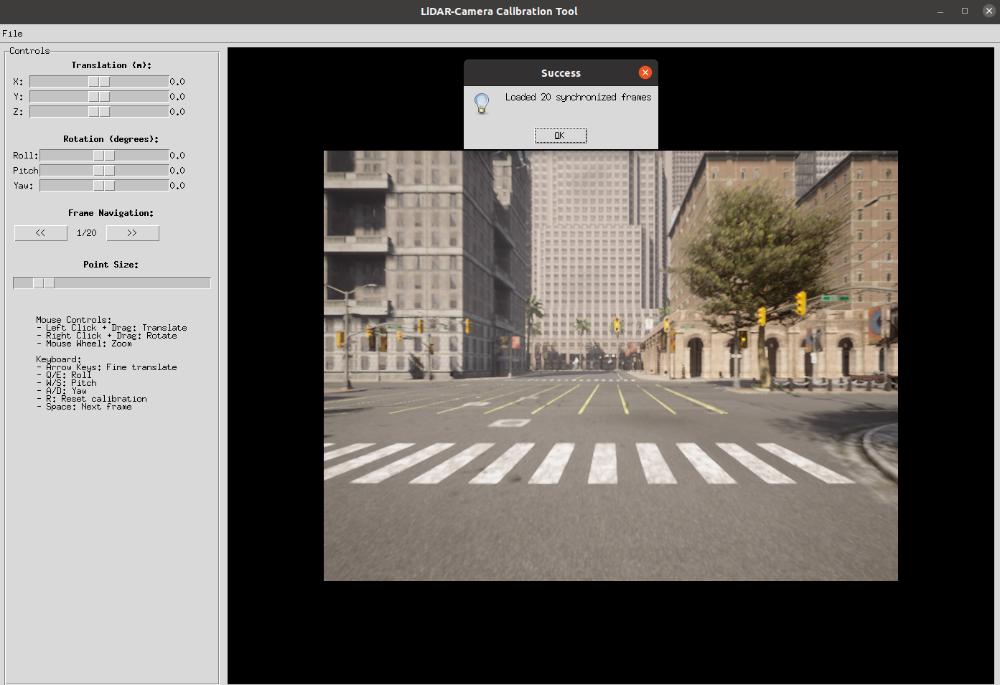
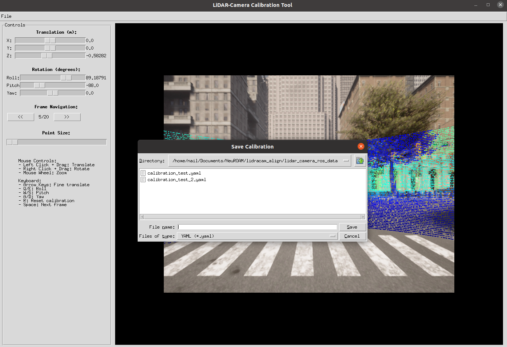

# LiDAR-Camera Calibration GUI

A simple and efficient GUI tool for manual alignment of camera frames and LiDAR point clouds from ROS/MCAP files. This tool provides mouse-based manual alignment without complex algorithms, making it easy to calibrate your sensor setup.

## Features

- **Multi-format Support**: ROS1 (.bag), ROS2 (.db3), and MCAP (.mcap) files
- **Mouse-based Manual Alignment**: Intuitive drag-and-drop calibration
- **Real-time Visualization**: Live preview of point cloud overlay on camera images
- **No ROS Installation Required**: Works with fallback implementations
- **Export Calibration Parameters**: Save results in JSON or YAML format
- **Simple and Efficient**: Minimal dependencies and clean interface

## Installation

### Prerequisites

- Python 3.7+
- OpenCV
- NumPy
- Tkinter (usually included with Python)

### Quick Install

1. **Clone the repository:**
   ```bash
   git clone https://github.com/neufieldrobotics/NeuROAM/tree/lidracam
   git checkout lidracam
   cd lidracam_align
   ```

2. **Install dependencies:**
   ```bash
   pip install opencv-python numpy pillow
   
   # For MCAP support (recommended):
   pip install mcap mcap-ros1-support mcap-ros2-support
   
   # For enhanced ROS bag support:
   pip install bagpy
   ```

3. **Run the GUI:**
   ```bash
   python calibration_gui.py
   ```

### Conda Environment (Recommended)

```bash
# Create a new conda environment
conda create -n lidarcam python=3.10
conda activate lidarcam

# Install dependencies
pip install opencv-python numpy pillow mcap mcap-ros1-support mcap-ros2-support bagpy

# Run the tool
python calibration_gui.py
```

## Usage

### 1. Launch the GUI



Run the calibration tool:
```bash
python calibration_gui.py
```

### 2. Load Your Data



Click "Load Bag" and select your ROS bag file (.bag), ROS2 bag (.db3), or MCAP file (.mcap). The tool will automatically detect the format and load camera images and LiDAR point clouds.

### 3. Manual Alignment



Use the intuitive controls to align the LiDAR points with the camera image:

- **Mouse Controls:**
  - Left click + drag: Translate the point cloud
  - Right click + drag: Rotate the point cloud
  - Mouse wheel: Zoom in/out

- **Parameter Controls:**
  - Translation sliders: Fine-tune X, Y, Z translation
  - Rotation sliders: Adjust Roll, Pitch, Yaw angles
  - Point size: Change visualization point size

### 4. Real-time Preview


See the alignment results in real-time as you adjust parameters. The LiDAR points are color-coded by depth for better visualization.

### 5. Save Calibration



Once satisfied with the alignment, click "Save Calibration" to export your results in JSON or YAML format.

## Output Format

The calibration tool outputs the following parameters:

### JSON Format
```json
{
  "rotation": [
    [0.99996192, -0.00872654, 0.00000000],
    [0.00872654, 0.99996192, 0.00000000],
    [0.00000000, 0.00000000, 1.00000000]
  ],
  "translation": [0.1, 0.05, 0.2],
  "camera_matrix": [
    [525.0, 0.0, 320.0],
    [0.0, 525.0, 240.0],
    [0.0, 0.0, 1.0]
  ],
  "dist_coeffs": [0.0, 0.0, 0.0, 0.0, 0.0],
  "image_width": 640,
  "image_height": 480
}
```

### YAML Format
```yaml
rotation:
- [0.99996192, -0.00872654, 0.00000000]
- [0.00872654, 0.99996192, 0.00000000]
- [0.00000000, 0.00000000, 1.00000000]
translation: [0.1, 0.05, 0.2]
camera_matrix:
- [525.0, 0.0, 320.0]
- [0.0, 525.0, 240.0]
- [0.0, 0.0, 1.0]
dist_coeffs: [0.0, 0.0, 0.0, 0.0, 0.0]
image_width: 640
image_height: 480

# Rotation matrix in readable format:
# [R1 R2 R3]
# [R4 R5 R6]
# [R7 R8 R9]
rotation_matrix_formatted: |
  [ 0.99996192 -0.00872654  0.00000000]
  [ 0.00872654  0.99996192  0.00000000]
  [ 0.00000000  0.00000000  1.00000000]

# Euler angles (degrees) [Roll, Pitch, Yaw]:
euler_angles_deg:
  roll: 0.000000
  pitch: 0.000000
  yaw: 0.500000
```

## Supported Data Formats

| Format | Extension | Description |
|--------|-----------|-------------|
| ROS1 Bag | `.bag` | Standard ROS1 bag files |
| ROS2 Bag | `.db3` | ROS2 SQLite database format |
| MCAP | `.mcap` | Modern container format for robotics data |

## Troubleshooting

### Common Issues

1. **"No bag reading libraries found" error:**
   ```bash
   pip install mcap mcap-ros1-support mcap-ros2-support
   ```

2. **"ROS messages not available" warning:**
   - This is normal and expected. The tool uses fallback implementations.
   - The GUI will still work perfectly.

3. **File not visible in dialog:**
   - Make sure your file has the correct extension (.bag, .db3, .mcap)
   - Try selecting "All files (*.*)" in the file dialog

4. **GUI closes immediately:**
   - Check the terminal for error messages
   - Ensure all dependencies are installed

### Performance Tips

- For large datasets, consider downsampling your point clouds before calibration
- MCAP format generally provides better performance than ROS bags
- Close other applications to ensure smooth real-time visualization

## Sample Data

The repository includes sample data in the `lidar_camera_ros_data/` directory:
- `carla-v2.2-t10.bag` - Sample ROS bag file for testing

## Contributing

Contributions are welcome! Please feel free to submit issues, feature requests, or pull requests.

## License

This project is open source. Please check the license file for details.

---

**Note**: This tool is designed for manual calibration. For automated calibration algorithms, consider using specialized robotics calibration packages.
